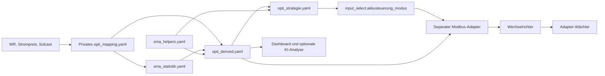

# Projektüberblick und Wartungsstand

Stand: September 2026. Die Steuerung ist ein Satz Home-Assistant-Packages,
keine eigene Integration und kein Python-Dienst. Python dient Tests und Simulation.

## Datenfluss und Zuständigkeiten



| Baustein | Aufgabe und wichtige Grenze |
|---|---|
| `opti_mapping.example.yaml` | Vorlage zur Normalisierung von Quellen auf `opti_*`, W, kWh und ct/kWh. Das ausgefüllte `packages/opti_mapping.yaml` bleibt privat. |
| `packages/opti_derived.yaml` | Prognose-Scores, Ziel-SoC, Ladeleistung, Preisniveau, Überschuss-Signale, Peak-Reserve, Balancing-Fälligkeit, Ladedeckel-Merker und Vorschau. |
| `automations/opti_strategie.yaml` | Priorisierte Entscheidung mit 22 Zweigen und Default; setzt den Modus und pflegt nachgelagert Booster/Ladepreis. Separater Fail-safe bei ungültigen Kerndaten. |
| `packages/sma_helpers.yaml` | Persistente Parameter und Schalter. Ohne `initial` restauriert HA vorhandene Werte; Erststart-Minima müssen bewusst gesetzt werden. |
| `packages/sma_statistik.yaml` | Gleitende Lastmittelwerte. Batterie-Leistung ist signiert, Hausverbrauch nicht. |
| `automations/opti_balancing_counter.yaml` | Bestätigt den Balancing-Abschluss über Minutenticks und persistente Helfer. |
| `packages/opti_ev_sperre.yaml` | Optionale Entladesperre bei evcc-Schnellladung, einschließlich Halten bei Datenlücken. |
| `packages/byd_monitoring.yaml` | Native BYD-Messwerte, Frischeprüfung und Alarme. Die Ruhe-Spreizung beeinflusst optional die Balancing-Fälligkeit. |
| `packages/byd_modul2_fruehwarnung.yaml` | Zyklusgebundene Messungen am schwächsten Modul, mit Anker, Bestätigungen und Invalidierung. |
| `packages/byd_knie_spreizung.yaml` | Verlauf der Zellspreizung am Ladeschluss, inklusive abgeschlossener Episoden. |
| `packages/opti_ki_analyse.yaml` und gleichnamige Automation | Kennzahlen und optionaler Tagesreport über `ai_task`; kann Benachrichtigungen senden, steuert den Akku nicht. |
| `dashboard-template/` | Anzeige und Bedienelemente; setzt die dokumentierten Entitäten und Karten voraus. |
| `packages/sma_templates.yaml` | Noch verwendbares Legacy-Pendant mit eigenen Quell-Platzhaltern. Nicht gleichbedeutend mit den archivierten Verzeichnissen `old/` und `legacy/`. |
| `packages/sma_modbus.yaml` | Optionaler SMA-Hub. Nicht zusätzlich laden, wenn derselbe Hub schon aus dem Adapter-Setup kommt. |
| Separates Adapter-Repository | Übersetzt Modi in Registerfolgen. Queued-Ausführung, Stale-Guard, Sperrfenster, Keepalive und Wirkungswächter bleiben dort. |

## Korrekturen dieser Wartungsrunde

- **#68:** Der Ladedeckel merkt einen tatsächlich erreichten MaxSOC unabhängig
  vom Modus. Das Halteband bleibt 3 Prozentpunkte breit. Grenzwertänderung,
  Datenlücke, Neustart und Reihenfolge der Sensor-Updates sind berücksichtigt.
  Strategie, Vorschau und Simulator verwenden den Merker.
- **Laufzeitanzeigen:** Alle benötigten Messwerte einschließlich PV werden
  geprüft. Restenergie ist Nennkapazität mal SoC-Differenz oberhalb MinSOC.
  Die alte Normierung auf das MinSOC/MaxSOC-Fenster entfällt. Der Legacy-Sensor
  verwendet weiterhin den Betrag der signierten Batterielast.
- **#64:** Die beiden BYD-Diagnosekurven behalten kWh und Messwertstatistiken,
  verlieren aber die inkompatible Geräteklasse `energy`. IDs bleiben gleich;
  es findet keine Löschung oder nachträgliche Umrechnung von Recorder-Daten statt.
- Installations-, Strategie- und Sensorreferenz beschreiben die Änderungen.

Die MinSOC-, Peak-, Balancing- und EV-Prioritäten wurden dabei beibehalten.
Neue Tarifoptimierung oder zusätzliche Hardware-Modi sind nicht Teil dieser Runde.

## Prüfung

Die reguläre Suite rendert die tatsächlichen YAML-/Jinja-Vorlagen, prüft alle
Strategiezweige gegen die Vorschau sowie Neustart-, Fehler- und Hysterese-Fälle.
Die 12 Tests des privaten Mappings bleiben ohne lokale Mapping-Datei übersprungen.

Zusätzlich ist eine isolierte Prüfung mit echtem HA verfügbar (Python 3.14):

```bash
python3 -m venv /tmp/opti-ha-test
/tmp/opti-ha-test/bin/pip install homeassistant==2026.9.0
/tmp/opti-ha-test/bin/python tools/validate_ha.py
```

Sie prüft native Template-/Automations-Schemas und führt mit synthetischen
Sensoren Ereignisfolgen, Datenlücken und einen echten HA-Neustart durch.
Es wird keine Verbindung zur Anlage aufgebaut. Modbus-Wirkung und Geräteverhalten
brauchen weiterhin eine gesondert freigegebene Live-Prüfung.

## Nächste sinnvolle Arbeiten

| Thema | Einordnung |
|---|---|
| #40 Datenqualität und Schreibkontrolle | Mit vorhandenen Schutzmechanismen abgleichen: SoC/Kapazitäts-Fail-safe, Preis-Ausfallverhalten und Adapter-Wirkungswächter sind vorhanden. Vollständige Frischeprüfung und Sollwertbestätigung fehlen weiterhin. SMA-Schreibregister liefern laut Adapter-Dokumentation kein verlässliches Read-back; daher kein blindes „schreiben, zurücklesen, wiederholen“. |
| #41 Zykluskosten | Parameter und Wirtschaftlichkeitsannahmen getrennt prüfen. Erst als nachvollziehbare Anzeige ergänzen, bevor Ladeentscheidungen verändert werden. |
| #42 Reserve bis zum Wiederaufladen | Die bestehende Peak-Reserve erweitern statt eine konkurrierende Entladegrenze einzuführen. Zunächst mit Vergleichsdaten im Beobachtungsbetrieb. |
| #9 SBS-Unterstützung | Braucht ein geprüftes Geräte-Mapping und einen passenden Adapter; die Canonical-Schicht allein bestätigt keine Registerkompatibilität. |
| #11 ältere Pause-Meldung | Gegen aktuellen Adapter und die konkrete Installation abgleichen. Ein alter Kommentar oder ein gesetzter Modus beweist keine physische Sperre. |
| Wartbarkeit | `opti_derived.yaml` und die gespiegelte Strategie sind groß. Die Paritätstests sichern Änderungen ab. Eine spätere Aufteilung braucht ein klares Upgrade-Verfahren für bestehende Packages. |
| Backtest | Stundenweise Nacht-/Peak-Simulation mit vereinfachtem Energiefluss. Kein Beweis für PV-Tagesoptimierung, Viertelstunden-Timing, Sommer-/Winterzeit oder echtes WR-Verhalten. |

Die Übernahme in eine laufende Installation ist unter
[Aktualisierung bestehender Installationen](installation.md#aktualisierung-bestehender-installationen-september-2026)
beschrieben. Vorhandene lokale Anpassungen und das private Mapping müssen dabei
erhalten bleiben.
